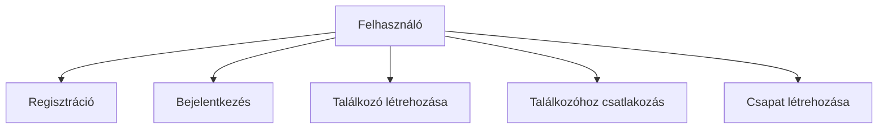
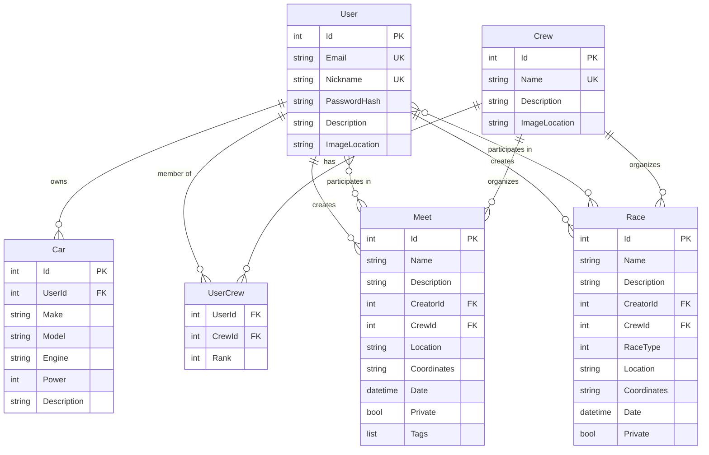

# Rev_n_Roll Szakdolgozat - Folytatási Terv

**Dátum:** 2026-03-03  
**Aktuális állapot:** 1. fejezet (Bevezetés) befejezve  
**Következő lépés:** 2. fejezet (Technológiai Áttekintés) írása

---

## Összefoglaló

A szakdolgozat 1. fejezete (Bevezetés) elkészült, amely tartalmazza:
- ✅ Motiváció és problémafelvetés
- ✅ A dolgozat célja és célkitűzései
- ✅ A megoldás rövid bemutatása
- ✅ A dolgozat felépítése

A következő lépés a fennmaradó 8 fejezet megírása a tervezett struktúra szerint.

---

## Fejezetek Részletes Terve

### 2. Fejezet - Technológiai Áttekintés (6-8 oldal)

**Cél:** Részletes bemutatás a felhasznált technológiákról és indoklás a választásukra.

#### 2.1. Backend technológiák

**2.1.1. .NET 9 és ASP.NET Core**
- .NET 9 platform főbb jellemzői
- ASP.NET Core előnyei webes API fejlesztéshez
- Cross-platform támogatás
- Teljesítmény és skálázhatóság
- Miért választottuk a .NET 9-et?

**2.1.2. Entity Framework Core**
- ORM (Object-Relational Mapping) koncepció
- Code-First megközelítés előnyei
- Migrációk kezelése
- LINQ lekérdezések
- Kapcsolódó fájlok: [`ThesisBackend/ThesisBackend.Data/dbContext.cs`](ThesisBackend/ThesisBackend.Data/dbContext.cs)

**2.1.3. C# nyelvi jellemzők**
- Modern C# funkciók (nullable reference types, pattern matching, records)
- Async/await programozási modell
- LINQ kifejezések
- Dependency Injection natív támogatása

#### 2.2. Frontend technológiák

**2.2.1. Angular 19 keretrendszer**
- Angular architektúra (komponensek, szolgáltatások, modulok)
- Reaktív programozás RxJS-sel
- Dependency Injection az Angularban
- Standalone komponensek (Angular 19 újdonság)
- Miért választottuk az Angulart?
- Kapcsolódó fájlok: [`rev-n-roll/package.json`](rev-n-roll/package.json)

**2.2.2. TypeScript**
- Típusbiztonság előnyei
- Interfészek és típusok
- Fejlesztői élmény javítása
- Kód karbantarthatóság

**2.2.3. Material Design**
- Google Material Design elvek
- Angular Material komponensek
- Egységes felhasználói élmény
- Reszponzív design támogatás

#### 2.3. Adatbázis technológia

**2.3.1. PostgreSQL**
- Relációs adatbázis-kezelő rendszer
- ACID tulajdonságok
- Teljesítmény és megbízhatóság
- JSON támogatás
- Miért választottuk a PostgreSQL-t?

**2.3.2. Relációs adatmodell**
- Normalizáció
- Referenciális integritás
- Indexek és megszorítások

#### 2.4. Egyéb technológiák

**2.4.1. JWT autentikáció**
- JSON Web Token működése
- Stateless autentikáció előnyei
- HttpOnly cookie-k biztonsága
- Token generálás és validáció
- Kapcsolódó fájlok: [`ThesisBackend/ThesisBackend.Services/Authentication/Services/TokenGenerator.cs`](ThesisBackend/ThesisBackend.Services/Authentication/Services/TokenGenerator.cs)

**2.4.2. FluentValidation**
- Deklaratív validáció
- Validációs szabályok szervezése
- Hibakezelés és hibaüzenetek
- Kapcsolódó fájlok: validátorok a Services rétegben

**2.4.3. Serilog naplózás**
- Strukturált naplózás koncepciója
- Log szintek (Information, Warning, Error)
- Sink-ek (Console, File, CloudWatch)
- Kapcsolódó fájlok: [`ThesisBackend/Program.cs`](ThesisBackend/Program.cs) (45-60. sorok)

**2.4.4. AWS CloudWatch**
- Felhő-alapú naplózás
- Központi log gyűjtés
- Monitoring és riasztások

---

### 3. Fejezet - Rendszerterv és Architektúra (8-10 oldal)

**Cél:** A rendszer tervezésének és architektúrájának részletes bemutatása.

#### 3.1. Követelményanalízis

**3.1.1. Funkcionális követelmények**
- Felhasználói regisztráció és bejelentkezés
- Profil kezelés és autók hozzáadása
- Találkozók létrehozása, szerkesztése, törlése
- Versenyek létrehozása, szerkesztése, törlése
- Csapatok létrehozása és kezelése
- Eseményekhez csatlakozás
- Keresés és szűrés (helyszín, koordináták, címkék)
- Nyilvános és privát események kezelése

**3.1.2. Nem-funkcionális követelmények**
- Teljesítmény: API válaszidő < 500ms
- Biztonság: JWT autentikáció, jelszó hashelés
- Skálázhatóság: Háromrétegű architektúra
- Karbantarthatóság: Clean Architecture, SOLID elvek
- Használhatóság: Intuitív felhasználói felület
- Megbízhatóság: Hibakezelés, naplózás

#### 3.2. Rendszerarchitektúra

**3.2.1. Háromrétegű architektúra**
- Prezentációs réteg (Angular frontend)
- Üzleti logika réteg (ASP.NET Core backend)
- Adatelérési réteg (Entity Framework Core + PostgreSQL)
- Rétegek közötti kommunikáció
- Diagram: Háromrétegű architektúra

**3.2.2. RESTful API tervezés**
- REST elvek (Resource-based, HTTP methods, Stateless)
- API végpontok struktúrája (/api/v1/...)
- HTTP státuszkódok használata
- Request/Response DTO-k
- API verziókezelés

**3.2.3. Kliens-szerver kommunikáció**
- HTTP protokoll
- JSON adatformátum
- CORS konfiguráció
- Cookie-alapú autentikáció

#### 3.3. Tervezési minták

**3.3.1. Repository pattern**
- Adatelérés absztrakciója
- Entity Framework Core mint repository
- Előnyök: tesztelhetőség, rugalmasság

**3.3.2. Dependency Injection**
- IoC (Inversion of Control) konténer
- Service lifetime-ok (Scoped, Singleton, Transient)
- Kapcsolódó fájlok: [`ThesisBackend/Program.cs`](ThesisBackend/Program.cs) (DI konfiguráció)

**3.3.3. Service layer pattern**
- Üzleti logika elkülönítése
- Service interfészek és implementációk
- Példa: AuthService, UserService, CarService

#### 3.4. Use Case diagramok

**Főbb use case-ek:**
- Felhasználói regisztráció és bejelentkezés
- Autó hozzáadása profilhoz
- Találkozó létrehozása
- Verseny létrehozása
- Csapat létrehozása és tagok kezelése
- Eseményhez csatlakozás
- Események keresése

**Mermaid diagram példa:**

#### 3.5. Komponens diagram

**Backend komponensek:**
- Controllers (API végpontok)
- Services (üzleti logika)
- Data (adatelérés)
- Domain (modellek, DTO-k)

**Frontend komponensek:**
- Components (UI komponensek)
- Services (HTTP szolgáltatások)
- Guards (route védelem)
- Models (TypeScript interfészek)

---

### 4. Fejezet - Adatbázis Tervezés (6-8 oldal)

**Cél:** Az adatmodell részletes bemutatása és az adatbázis séma dokumentálása.

#### 4.1. Adatmodell tervezése

**4.1.1. Entitások azonosítása**
- User: Felhasználók adatai
- Car: Autók adatai
- Crew: Csapatok adatai
- Meet: Találkozók adatai
- Race: Versenyek adatai
- UserCrew: Kapcsolótábla (User-Crew N:M kapcsolat)

**4.1.2. Kapcsolatok definiálása**
- User 1:N Car (egy felhasználónak több autója lehet)
- User N:M Crew (UserCrew kapcsolótáblán keresztül, rangokkal)
- User N:M Meet (résztvevők)
- User N:M Race (résztvevők)
- User 1:N Meet (létrehozó)
- User 1:N Race (létrehozó)
- Crew 1:N Meet (csapat találkozói)

#### 4.2. Adatbázis séma

**4.2.1. User entitás**
- Mezők: Id, Email, Nickname, PasswordHash, Description, ImageLocation
- Kapcsolódó fájl: [`ThesisBackend/ThesisBackend.Domain/Models/User.cs`](ThesisBackend/ThesisBackend.Domain/Models/User.cs)
- Unique indexek: Email, Nickname
- Navigációs tulajdonságok: Cars, UserCrews, Races, Meets, CreatedRaces, CreatedMeets

**4.2.2. Car entitás**
- Mezők: Id, UserId, Make, Model, Engine, Power, Description
- Kapcsolódó fájl: [`ThesisBackend/ThesisBackend.Domain/Models/Car.cs`](ThesisBackend/ThesisBackend.Domain/Models/Car.cs)
- Foreign key: UserId → User.Id

**4.2.3. Crew entitás és UserCrew kapcsolótábla**
- Crew mezők: Id, Name, Description, ImageLocation
- UserCrew mezők: UserId, CrewId, Rank (Leader, Co-Leader, Recruiter, Member)
- Kapcsolódó fájlok: 
  - [`ThesisBackend/ThesisBackend.Domain/Models/Crew.cs`](ThesisBackend/ThesisBackend.Domain/Models/Crew.cs)
  - [`ThesisBackend/ThesisBackend.Domain/Models/UserCrew.cs`](ThesisBackend/ThesisBackend.Domain/Models/UserCrew.cs)
- Unique index: Crew.Name

**4.2.4. Meet entitás**
- Mezők: Id, Name, Description, CreatorId, CrewId, Location, Coordinates, Date, Private, Tags
- Kapcsolódó fájl: [`ThesisBackend/ThesisBackend.Domain/Models/Meet.cs`](ThesisBackend/ThesisBackend.Domain/Models/Meet.cs)
- Foreign keys: CreatorId → User.Id, CrewId → Crew.Id (nullable)
- Computed properties: Latitude, Longitude (NotMapped)
- Tags enum: CarsNCoffee, Cruising, MeetNGreet, AmpsNWoofers, Racing, Tour

**4.2.5. Race entitás**
- Mezők: Id, Name, Description, CreatorId, CrewId, RaceType, Location, Coordinates, Date, Private
- Kapcsolódó fájl: [`ThesisBackend/ThesisBackend.Domain/Models/Race.cs`](ThesisBackend/ThesisBackend.Domain/Models/Race.cs)
- Foreign keys: CreatorId → User.Id, CrewId → Crew.Id (nullable)
- RaceType enum: Drag, Circuit, Drift, Rally
- Computed properties: Latitude, Longitude (NotMapped)

**4.2.6. Many-to-many kapcsolatok**
- UserMeet: User ↔ Meet (résztvevők)
- UserRace: User ↔ Race (résztvevők)
- Implicit kapcsolótáblák (EF Core konvenció)

#### 4.3. Entity Framework Core konfiguráció

**4.3.1. DbContext implementáció**
- DbSet-ek definiálása
- Kapcsolódó fájl: [`ThesisBackend/ThesisBackend.Data/dbContext.cs`](ThesisBackend/ThesisBackend.Data/dbContext.cs)
- OnModelCreating metódus

**4.3.2. Fluent API konfiguráció**
- Unique indexek konfigurálása (23-33. sorok)
- UserCrew kapcsolat konfigurálása (36-44. sorok)
- Many-to-many kapcsolatok (47-56. sorok)
- Foreign key-k és delete behavior (59-90. sorok)

**4.3.3. Indexek és megszorítások**
- Unique indexek: User.Email, User.Nickname, Crew.Name
- Required mezők: [Required] attribútumok
- StringLength megszorítások
- OnDelete(DeleteBehavior.SetNull) a Crew kapcsolatoknál

#### 4.4. Migrációk kezelése

- Code-First migrációk
- Migration parancsok: Add-Migration, Update-Database
- Migráció fájlok struktúrája
- Adatbázis verziókezelés

#### 4.5. ER diagram

**Mermaid ER diagram:**

---

### 5. Fejezet - Backend Implementáció (10-12 oldal)

**Cél:** A backend implementáció részletes bemutatása kódrészletekkel.

#### 5.1. Projekt struktúra

**5.1.1. ThesisBackend.Domain - Domain modellek**
- Models mappa: User, Car, Crew, Meet, Race, UserCrew, Enums
- Messages mappa: Request/Response DTO-k
- Clean Architecture: Domain réteg független minden mástól

**5.1.2. ThesisBackend.Data - Adatelérési réteg**
- dbContext.cs: Entity Framework Core konfiguráció
- ConnectionString.cs: Kapcsolati string kezelés
- Migrációk

**5.1.3. ThesisBackend.Services - Üzleti logika**
- Authentication: AuthService, TokenGenerator, PasswordHasher
- UserService, CarService, CrewService, MeetService, RaceService
- Validators: FluentValidation validátorok
- Interfaces: Service interfészek

**5.1.4. ThesisBackend - API réteg**
- Controllers: AuthController, UserController, CarController, CrewController, MeetController, RaceController
- Program.cs: Alkalmazás konfigurációja
- Middleware pipeline

#### 5.2. Autentikáció és autorizáció

**5.2.1. JWT token generálás (TokenGenerator.cs)**
- Claims létrehozása (UserId, Email)
- Token aláírás szimmetrikus kulccsal
- Token lejárati idő beállítása
- Kódrészlet példa

**5.2.2. Jelszó hashelés (PasswordHasher.cs)**
- BCrypt algoritmus használata
- Salt generálás
- Jelszó verifikáció
- Biztonsági szempontok

**5.2.3. AuthService implementáció**
- Register metódus: felhasználó létrehozása
- Login metódus: autentikáció
- Email és nickname egyediség ellenőrzése
- Jelszó hashelés és verifikáció
- Kapcsolódó fájl: [`ThesisBackend/ThesisBackend.Services/Authentication/Services/AuthService.cs`](ThesisBackend/ThesisBackend.Services/Authentication/Services/AuthService.cs)

**5.2.4. AuthController végpontok**
- POST /api/v1/Authentication/register
- POST /api/v1/Authentication/login
- POST /api/v1/Authentication/logout
- HttpOnly cookie beállítása
- Kapcsolódó fájl: [`ThesisBackend/Controllers/AuthController.cs`](ThesisBackend/Controllers/AuthController.cs)

#### 5.3. Validáció

**5.3.1. FluentValidation integráció**
- AddFluentValidationAutoValidation() konfiguráció
- Automatikus validáció a controllerekben
- ValidationProblemDetails válasz

**5.3.2. Request validátorok**
- RegistrationRequestValidator: email, nickname, jelszó szabályok
- LoginRequestValidator: email és jelszó kötelező
- CarRequestValidator: autó adatok validálása
- MeetRequestValidator: találkozó adatok validálása
- RaceRequestValidator: verseny adatok validálása
- Példa kódrészletek

#### 5.4. API végpontok implementációja

**5.4.1. UserController**
- GET /api/v1/User/{id}: felhasználó lekérdezése
- PUT /api/v1/User/{id}: felhasználó frissítése
- DELETE /api/v1/User/{id}: felhasználó törlése
- Kapcsolódó fájl: [`ThesisBackend/Controllers/UserController.cs`](ThesisBackend/Controllers/UserController.cs)

**5.4.2. CarController**
- GET /api/v1/Car/user/{userId}: felhasználó autóinak lekérdezése
- POST /api/v1/Car: autó létrehozása
- PUT /api/v1/Car/{id}: autó frissítése
- DELETE /api/v1/Car/{id}: autó törlése
- Kapcsolódó fájl: [`ThesisBackend/Controllers/CarController.cs`](ThesisBackend/Controllers/CarController.cs)

**5.4.3. CrewController**
- GET /api/v1/Crew: összes csapat lekérdezése
- GET /api/v1/Crew/{id}: csapat lekérdezése
- POST /api/v1/Crew: csapat létrehozása
- PUT /api/v1/Crew/{id}: csapat frissítése
- DELETE /api/v1/Crew/{id}: csapat törlése
- POST /api/v1/Crew/{crewId}/user: tag hozzáadása
- Kapcsolódó fájl: [`ThesisBackend/Controllers/CrewController.cs`](ThesisBackend/Controllers/CrewController.cs)

**5.4.4. MeetController**
- GET /api/v1/Meet: találkozók lekérdezése (szűrési paraméterekkel)
- GET /api/v1/Meet/{id}: találkozó lekérdezése
- POST /api/v1/Meet: találkozó létrehozása
- PUT /api/v1/Meet/{id}: találkozó frissítése
- DELETE /api/v1/Meet/{id}: találkozó törlése
- POST /api/v1/Meet/{meetId}/join: csatlakozás találkozóhoz
- Kapcsolódó fájl: [`ThesisBackend/Controllers/MeetController.cs`](ThesisBackend/Controllers/MeetController.cs)

**5.4.5. RaceController**
- GET /api/v1/Race: versenyek lekérdezése (szűrési paraméterekkel)
- GET /api/v1/Race/{id}: verseny lekérdezése
- POST /api/v1/Race: verseny létrehozása
- PUT /api/v1/Race/{id}: verseny frissítése
- DELETE /api/v1/Race/{id}: verseny törlése
- POST /api/v1/Race/{raceId}/join: csatlakozás versenyhez
- Kapcsolódó fájl: [`ThesisBackend/Controllers/RaceController.cs`](ThesisBackend/Controllers/RaceController.cs)

#### 5.5. Service réteg

**5.5.1. UserService**
- GetUserById: felhasználó lekérdezése ID alapján
- UpdateUser: felhasználó adatainak frissítése
- DeleteUser: felhasználó törlése
- Include navigációs tulajdonságok (Cars, UserCrews)

**5.5.2. CarService**
- GetCarsByUserId: felhasználó autóinak lekérdezése
- CreateCar: autó létrehozása
- UpdateCar: autó frissítése
- DeleteCar: autó törlése
- Kapcsolódó fájl: [`ThesisBackend/ThesisBackend.Services/CarService/Services/CarService.cs`](ThesisBackend/ThesisBackend.Services/CarService/Services/CarService.cs)

**5.5.3. CrewService**
- GetAllCrews: összes csapat lekérdezése
- GetCrewById: csapat lekérdezése ID alapján
- CreateCrew: csapat létrehozása
- UpdateCrew: csapat frissítése
- DeleteCrew: csapat törlése
- AddUserToCrew: tag hozzáadása csapathoz
- Kapcsolódó fájl: [`ThesisBackend/ThesisBackend.Services/CrewService/Services/CrewService.cs`](ThesisBackend/ThesisBackend.Services/CrewService/Services/CrewService.cs)

**5.5.4. MeetService**
- GetMeets: találkozók lekérdezése szűrési paraméterekkel
- GetMeetById: találkozó lekérdezése ID alapján
- CreateMeet: találkozó létrehozása
- UpdateMeet: találkozó frissítése
- DeleteMeet: találkozó törlése
- JoinMeet: csatlakozás találkozóhoz
- Földrajzi szűrés implementálása (koordináták alapján)
- Kapcsolódó fájl: [`ThesisBackend/ThesisBackend.Services/MeetService/Services/MeetService.cs`](ThesisBackend/ThesisBackend.Services/MeetService/Services/MeetService.cs)

**5.5.5. RaceService**
- GetRaces: versenyek lekérdezése szűrési paraméterekkel
- GetRaceById: verseny lekérdezése ID alapján
- CreateRace: verseny létrehozása
- UpdateRace: verseny frissítése
- DeleteRace: verseny törlése
- JoinRace: csatlakozás versenyhez
- Földrajzi szűrés implementálása
- Kapcsolódó fájl: [`ThesisBackend/ThesisBackend.Services/RaceService/Services/RaceService.cs`](ThesisBackend/ThesisBackend.Services/RaceService/Services/RaceService.cs)

#### 5.6. Hibakezelés és naplózás

**5.6.1. Globális hibakezelés**
- UseExceptionHandler middleware
- Strukturált hibaválaszok
- HTTP státuszkódok megfelelő használata
- Kapcsolódó fájl: [`ThesisBackend/Program.cs`](ThesisBackend/Program.cs)

**5.6.2. Serilog konfiguráció**
- Serilog inicializálása
- Log szintek konfigurálása
- Console és File sink-ek
- Strukturált naplózás előnyei
- Kapcsolódó fájl: [`ThesisBackend/Program.cs`](ThesisBackend/Program.cs) (45-60. sorok)

**5.6.3. CloudWatch integráció**
- AWS CloudWatch sink konfiguráció
- Központi log gyűjtés
- Log csoportok és streamek
- Monitoring és riasztások

#### 5.7. CORS és middleware konfiguráció

- CORS policy beállítása
- AllowCredentials (cookie-k engedélyezése)
- AllowedOrigins konfiguráció
- Middleware pipeline sorrendje
- Kapcsolódó fájl: [`ThesisBackend/Program.cs`](ThesisBackend/Program.cs)

---

### 6. Fejezet - Frontend Implementáció (8-10 oldal)

**Cél:** Az Angular frontend részletes bemutatása komponensekkel és szolgáltatásokkal.

#### 6.1. Angular projekt struktúra

**6.1.1. Komponensek szervezése**
- Feature-based szervezés
- Komponensek mappája: components/
- Dialógus komponensek: add-car-dialog, add-meet-dialog, add-race-dialog, add-crew-dialog
- Főbb nézetek: home, login, register, profile, meets, races, crews
- Kapcsolódó mappa: [`rev-n-roll/src/app/components/`](rev-n-roll/src/app/components/)

**6.1.2. Szolgáltatások (Services)**
- HTTP szolgáltatások: auth.service, user.service, car.service, meet.service, race.service, crew.service
- Singleton szolgáltatások (providedIn: 'root')
- Kapcsolódó mappa: [`rev-n-roll/src/app/services/`](rev-n-roll/src/app/services/)

**6.1.3. Modellek**
- TypeScript interfészek: User, Car, Crew, Meet, Race
- Enum-ok: MeetTags, RaceType, CrewRank
- Kapcsolódó mappa: [`rev-n-roll/src/app/models/`](rev-n-roll/src/app/models/)

**6.1.4. Guards és routing**
- AuthGuard: route védelem
- Routing konfiguráció: app.routes.ts
- Lazy loading (ha alkalmazva)
- Kapcsolódó fájlok:
  - [`rev-n-roll/src/app/guards/auth.guard.ts`](rev-n-roll/src/app/guards/auth.guard.ts)
  - [`rev-n-roll/src/app/app.routes.ts`](rev-n-roll/src/app/app.routes.ts)

#### 6.2. Autentikáció a kliensen

**6.2.1. AuthService (auth.service.ts)**
- login() metódus: bejelentkezés
- register() metódus: regisztráció
- logout() metódus: kijelentkezés
- isLoggedIn() metódus: autentikációs állapot ellenőrzése
- getUserId() metódus: bejelentkezett felhasználó ID-ja
- withCredentials: true (cookie-k küldése)
- Kapcsolódó fájl: [`rev-n-roll/src/app/services/auth.service.ts`](rev-n-roll/src/app/services/auth.service.ts)

**6.2.2. AuthGuard implementáció**
- CanActivateFn használata (Angular 19)
- Védett route-ok ellenőrzése
- Átirányítás login oldalra
- Kapcsolódó fájl: [`rev-n-roll/src/app/guards/auth.guard.ts`](rev-n-roll/src/app/guards/auth.guard.ts)

**6.2.3. Token kezelés**
- HttpOnly cookie-k (backend kezeli)
- User ID tárolása localStorage-ban
- Autentikációs állapot memóriában

#### 6.3. Főbb komponensek

**6.3.1. Login és Register komponensek**
- Reactive Forms használata
- FormGroup és FormControl
- Validáció (email, jelszó)
- Hibaüzenetek megjelenítése
- Kapcsolódó fájlok:
  - [`rev-n-roll/src/app/components/login/login.component.ts`](rev-n-roll/src/app/components/login/login.component.ts)
  - [`rev-n-roll/src/app/components/register/register.component.ts`](rev-n-roll/src/app/components/register/register.component.ts)

**6.3.2. Profile komponens**
- Felhasználó adatainak megjelenítése
- Autók listázása
- Autó hozzáadása (dialog)
- Autó törlése
- Profil szerkesztése (dialog)
- Kapcsolódó fájl: [`rev-n-roll/src/app/components/profile/profile.component.ts`](rev-n-roll/src/app/components/profile/profile.component.ts)

**6.3.3. Meets komponens**
- Találkozók listázása
- Szűrés (helyszín, címkék, dátum)
- Találkozó létrehozása (dialog)
- Találkozó részleteinek megjelenítése (dialog)
- Csatlakozás találkozóhoz
- Kapcsolódó fájl: [`rev-n-roll/src/app/components/meets/meets.component.ts`](rev-n-roll/src/app/components/meets/meets.component.ts)

**6.3.4. Races komponens**
- Versenyek listázása
- Szűrés (helyszín, típus, dátum)
- Verseny létrehozása (dialog)
- Verseny részleteinek megjelenítése (dialog)
- Csatlakozás versenyhez
- Kapcsolódó fájl: [`rev-n-roll/src/app/components/races/races.component.ts`](rev-n-roll/src/app/components/races/races.component.ts)

**6.3.5. Crews komponens**
- Csapatok listázása
- Csapat létrehozása (dialog)
- Csapat részleteinek megjelenítése
- Tagok kezelése
- Kapcsolódó fájl: [`rev-n-roll/src/app/components/crews/crews.component.ts`](rev-n-roll/src/app/components/crews/crews.component.ts)

#### 6.4. HTTP szolgáltatások

**6.4.1. UserService**
- getUser(id): felhasználó lekérdezése
- updateUser(id, data): felhasználó frissítése
- deleteUser(id): felhasználó törlése
- Kapcsolódó fájl: [`rev-n-roll/src/app/services/user.service.ts`](rev-n-roll/src/app/services/user.service.ts)

**6.4.2. CarService**
- getCarsByUserId(userId): autók lekérdezése
- createCar(data): autó létrehozása
- updateCar(id, data): autó frissítése
- deleteCar(id): autó törlése
- Kapcsolódó fájl: [`rev-n-roll/src/app/services/car.service.ts`](rev-n-roll/src/app/services/car.service.ts)

**6.4.3. MeetService**
- getMeets(params): találkozók lekérdezése szűrési paraméterekkel
- getMeetById(id): találkozó lekérdezése
- createMeet(data): találkozó létrehozása
- updateMeet(id, data): találkozó frissítése
- deleteMeet(id): találkozó törlése
- joinMeet(meetId, userId): csatlakozás találkozóhoz
- Kapcsolódó fájl: [`rev-n-roll/src/app/services/meet.service.ts`](rev-n-roll/src/app/services/meet.service.ts)

**6.4.4. RaceService**
- getRaces(params): versenyek lekérdezése szűrési paraméterekkel
- getRaceById(id): verseny lekérdezése
- createRace(data): verseny létrehozása
- updateRace(id, data): verseny frissítése
- deleteRace(id): verseny törlése
- joinRace(raceId, userId): csatlakozás versenyhez
- Kapcsolódó fájl: [`rev-n-roll/src/app/services/race.service.ts`](rev-n-roll/src/app/services/race.service.ts)

**6.4.5. CrewService**
- getCrews(): csapatok lekérdezése
- getCrewById(id): csapat lekérdezése
- createCrew(data): csapat létrehozása
- updateCrew(id, data): csapat frissítése
- deleteCrew(id): csapat törlése
- addUserToCrew(crewId, userId, rank): tag hozzáadása
- Kapcsolódó fájl: [`rev-n-roll/src/app/services/crew.service.ts`](rev-n-roll/src/app/services/crew.service.ts)

#### 6.5. Material Design integráció

**6.5.1. Dialog komponensek**
- MatDialog használata
- Dialog megnyitása és bezárása
- Adatok átadása dialognak
- Visszatérési érték kezelése
- Példák: AddCarDialogComponent, AddMeetDialogComponent, AddRaceDialogComponent

**6.5.2. Form elemek**
- MatFormField
- MatInput
- MatSelect
- MatDatepicker
- MatCheckbox
- MatChipList (címkék kezelése)

**6.5.3. Navigáció**
- MatToolbar
- MatButton
- MatIcon
- Routing linkek
- Kapcsolódó fájl: [`rev-n-roll/src/app/components/nav-bar/nav-bar.component.ts`](rev-n-roll/src/app/components/nav-bar/nav-bar.component.ts)

#### 6.6. Routing és navigáció

- Route-ok definiálása
- AuthGuard alkalmazása védett route-okon
- Navigáció programozottan (Router.navigate)
- Route paraméterek kezelése
- Kapcsolódó fájl: [`rev-n-roll/src/app/app.routes.ts`](rev-n-roll/src/app/app.routes.ts)

---

### 7. Fejezet - Tesztelés és Minőségbiztosítás (6-8 oldal)

**Cél:** A tesztelési stratégia és a megvalósított tesztek bemutatása.

#### 7.1. Tesztelési stratégia

- Tesztelési piramis: Unit tests, Integration tests, E2E tests
- Test-Driven Development (TDD) elemek
- Tesztelési célok: kód lefedettség, regressziós hibák megelőzése
- Automatizált tesztelés fontossága

#### 7.2. Backend tesztek

**7.2.1. Egységtesztek (Unit Tests)**
- Service réteg tesztelése
- Mock objektumok használata (Moq)
- Példák: AuthService tesztek, UserService tesztek
- Kapcsolódó mappa: [`ThesisBackend/ThesisBackend.Services.Tests/`](ThesisBackend/ThesisBackend.Services.Tests/) (ha létezik)

**7.2.2. Integrációs tesztek**
- API végpontok tesztelése
- WebApplicationFactory használata
- In-memory adatbázis (SQLite)
- HTTP kérések és válaszok tesztelése
- Kapcsolódó mappa: [`ThesisBackend/ThesisBackend.Api.Tests/`](ThesisBackend/ThesisBackend.Api.Tests/)

**AuthControllerTests:**
- Register_ValidRequest_ReturnsOk
- Register_DuplicateEmail_ReturnsBadRequest
- Login_ValidCredentials_ReturnsOk
- Login_InvalidCredentials_ReturnsUnauthorized
- Kapcsolódó fájl: [`ThesisBackend/ThesisBackend.Api.Tests/Authentication/AuthControllerTests.cs`](ThesisBackend/ThesisBackend.Api.Tests/Authentication/AuthControllerTests.cs)

**CarControllerTests:**
- GetCarsByUserId_ValidUserId_ReturnsOk
- CreateCar_ValidRequest_ReturnsCreated
- UpdateCar_ValidRequest_ReturnsOk
- DeleteCar_ValidId_ReturnsNoContent
- Kapcsolódó fájl: [`ThesisBackend/ThesisBackend.Api.Tests/CarController/CarControllerTests.cs`](ThesisBackend/ThesisBackend.Api.Tests/CarController/CarControllerTests.cs)

**CrewControllerTests:**
- GetAllCrews_ReturnsOk
- CreateCrew_ValidRequest_ReturnsCreated
- AddUserToCrew_ValidRequest_ReturnsOk
- Kapcsolódó fájl: [`ThesisBackend/ThesisBackend.Api.Tests/CrewController/CrewController.cs`](ThesisBackend/ThesisBackend.Api.Tests/CrewController/CrewController.cs)

**MeetControllerTests:**
- GetMeets_ReturnsOk
- CreateMeet_ValidRequest_ReturnsCreated
- JoinMeet_ValidRequest_ReturnsOk
- Kapcsolódó fájl: [`ThesisBackend/ThesisBackend.Api.Tests/MeetController/MeetControllerTests.cs`](ThesisBackend/ThesisBackend.Api.Tests/MeetController/MeetControllerTests.cs)

**RaceControllerTests:**
- GetRaces_ReturnsOk
- CreateRace_ValidRequest_ReturnsCreated
- JoinRace_ValidRequest_ReturnsOk
- Kapcsolódó fájl: [`ThesisBackend/ThesisBackend.Api.Tests/RaceController/RaceControllerTests.cs`](ThesisBackend/ThesisBackend.Api.Tests/RaceController/RaceControllerTests.cs)

**UserControllerTests:**
- GetUser_ValidId_ReturnsOk
- UpdateUser_ValidRequest_ReturnsOk
- DeleteUser_ValidId_ReturnsNoContent
- Kapcsolódó fájl: [`ThesisBackend/ThesisBackend.Api.Tests/UserController/UserControllerTests.cs`](ThesisBackend/ThesisBackend.Api.Tests/UserController/UserControllerTests.cs)

#### 7.3. xUnit keretrendszer használata

- xUnit alapok: [Fact], [Theory], [InlineData]
- Arrange-Act-Assert pattern
- Test fixtures és setup
- Async tesztek
- Kódrészlet példák

#### 7.4. Test coverage és eredmények

- Kód lefedettség mérése
- Coverage report generálása
- Lefedettségi célok (pl. 80% coverage)
- Kritikus kódrészek tesztelése

#### 7.5. Kódminőség

- Code review folyamat
- Statikus kódelemzés
- Coding standards betartása
- SOLID elvek alkalmazása
- Clean Code gyakorlatok

---

### 8. Fejezet - CI/CD és DevOps (4-5 oldal)

**Cél:** A folyamatos integráció és deployment folyamat bemutatása.

#### 8.1. GitHub Actions workflow

- Workflow fájl struktúrája
- Trigger események (pull_request, push)
- Jobs és steps
- Kapcsolódó fájl: [`.github/workflows/BuildAndTest.yml`](.github/workflows/BuildAndTest.yml)

#### 8.2. Automatizált build folyamat

- Checkout code step
- .NET SDK telepítése (setup-dotnet@v4)
- dotnet-ef tool telepítése
- Dependencies restore (dotnet restore)
- Build (dotnet build)
- Kódrészlet példa

#### 8.3. Automatizált tesztelés

- Test futtatás (dotnet test)
- Test eredmények megjelenítése
- Sikertelen build esetén értesítés
- Kódrészlet példa

#### 8.4. Deployment stratégia

- Környezetek: Development, Staging, Production
- Deployment célok (pl. Azure, AWS, Docker)
- Adatbázis migrációk futtatása
- Environment-specific konfiguráció

#### 8.5. Környezeti változók kezelése

- GitHub Secrets használata
- appsettings.json és appsettings.Development.json
- Kapcsolati stringek biztonságos tárolása
- JWT kulcs kezelése
- Kapcsolódó fájlok:
  - [`ThesisBackend/appsettings.json`](ThesisBackend/appsettings.json)
  - [`ThesisBackend/appsettings.Development.json`](ThesisBackend/appsettings.Development.json)

---

### 9. Fejezet - Összefoglalás és Továbbfejlesztési Lehetőségek (3-4 oldal)

**Cél:** Az elért eredmények összegzése és jövőbeli fejlesztési irányok felvázolása.

#### 9.1. Elért eredmények

- Funkcionális követelmények teljesítése
- Technológiai célok elérése
- Háromrétegű architektúra megvalósítása
- RESTful API implementálása
- Modern frontend Angular-ban
- Biztonságos autentikáció JWT-vel
- Átfogó tesztelés xUnit-tal
- CI/CD pipeline GitHub Actions-szel

#### 9.2. Tapasztalatok

- Technológiai tanulságok (.NET 9, Angular 19)
- Architektúrális döntések értékelése
- Fejlesztési folyamat tapasztalatai
- Kihívások és megoldások
- Clean Architecture előnyei

#### 9.3. Továbbfejlesztési lehetőségek

**9.3.1. Valós idejű értesítések (SignalR)**
- WebSocket alapú kommunikáció
- Valós idejű esemény frissítések
- Chat funkció csapatokon belül
- Értesítések új eseményekről

**9.3.2. Képfeltöltés és tárolás**
- Profilképek feltöltése
- Autók képeinek feltöltése
- Esemény képek
- Cloud storage integráció (AWS S3, Azure Blob)

**9.3.3. Email értesítések**
- Regisztráció megerősítés
- Esemény emlékeztetők
- Csapat meghívók
- SMTP integráció

**9.3.4. Térkép integráció fejlesztése**
- Google Maps API integráció
- Interaktív térkép események megjelenítésével
- Útvonaltervezés
- Helyszín kiválasztás térképen

**9.3.5. Mobil alkalmazás**
- React Native vagy Flutter
- Natív iOS és Android alkalmazás
- Push értesítések
- Offline funkciók

**9.3.6. Egyéb fejlesztési lehetőségek**
- Közösségi funkciók bővítése (kommentek, értékelések)
- Esemény naptár integráció
- Statisztikák és analytics
- Admin dashboard
- Multi-language támogatás

#### 9.4. Záró gondolatok

- A projekt jelentősége az autós közösség számára
- Tanulási eredmények
- Szakmai fejlődés
- Köszönetnyilvánítás

---

## Következő Lépések

### Azonnali teendők:

1. **Felhasználói jóváhagyás kérése** erre a tervre
2. **2. fejezet (Technológiai Áttekintés) megírása**
   - Részletes technológiai leírások
   - Indoklások a választásokra
   - Kódrészletek és példák
3. **Folytatás a további fejezetekkel** a terv szerint

### Írási irányelvek:

- **Hivatkozások:** Minden kódrészletre hivatkozni kell a megfelelő fájlra
- **Példák:** Konkrét kódrészleteket bemutatni
- **Diagramok:** Mermaid diagramok használata ahol releváns
- **Szakmai nyelv:** Technikai pontosság és érthetőség
- **Struktúra:** Logikus felépítés, alfejezetek használata
- **Terjedelem:** Fejezetek tervezett oldalszámának betartása

### Fájlok, amelyekre hivatkozni kell:

**Backend:**
- [`ThesisBackend/Program.cs`](ThesisBackend/Program.cs)
- [`ThesisBackend/ThesisBackend.Data/dbContext.cs`](ThesisBackend/ThesisBackend.Data/dbContext.cs)
- [`ThesisBackend/ThesisBackend.Domain/Models/*.cs`](ThesisBackend/ThesisBackend.Domain/Models/)
- [`ThesisBackend/Controllers/*.cs`](ThesisBackend/Controllers/)
- [`ThesisBackend/ThesisBackend.Services/**/*.cs`](ThesisBackend/ThesisBackend.Services/)
- [`ThesisBackend/ThesisBackend.Api.Tests/**/*.cs`](ThesisBackend/ThesisBackend.Api.Tests/)

**Frontend:**
- [`rev-n-roll/package.json`](rev-n-roll/package.json)
- [`rev-n-roll/src/app/services/*.ts`](rev-n-roll/src/app/services/)
- [`rev-n-roll/src/app/components/**/*.ts`](rev-n-roll/src/app/components/)
- [`rev-n-roll/src/app/guards/auth.guard.ts`](rev-n-roll/src/app/guards/auth.guard.ts)
- [`rev-n-roll/src/app/app.routes.ts`](rev-n-roll/src/app/app.routes.ts)

**DevOps:**
- [`.github/workflows/BuildAndTest.yml`](.github/workflows/BuildAndTest.yml)

---

## Megjegyzések

- A terv rugalmas, szükség esetén módosítható
- Minden fejezet után felülvizsgálat és finomítás
- Diagramok és ábrák készítése Mermaid-del
- Kódrészletek formázása és kommentálása
- Szakirodalmi hivatkozások gyűjtése folyamatosan
